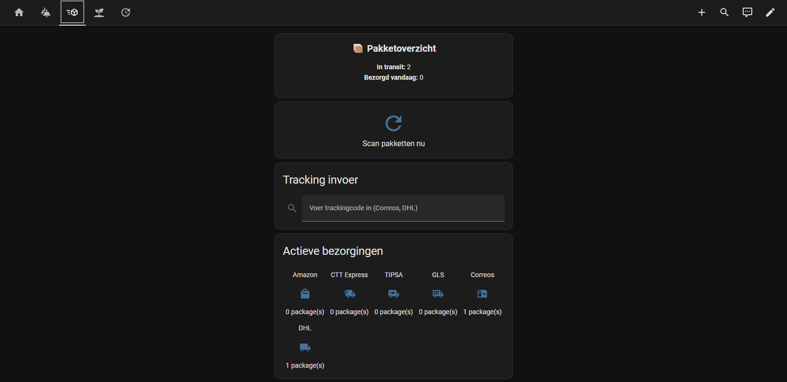
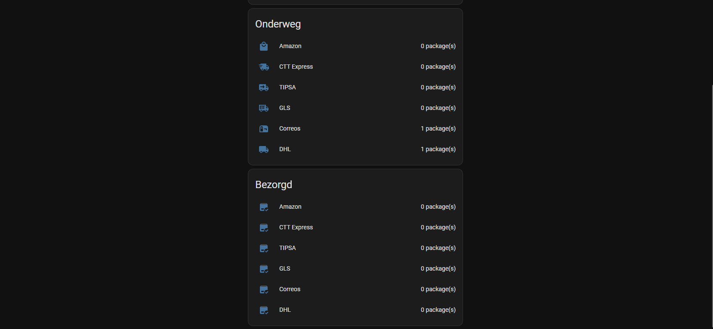
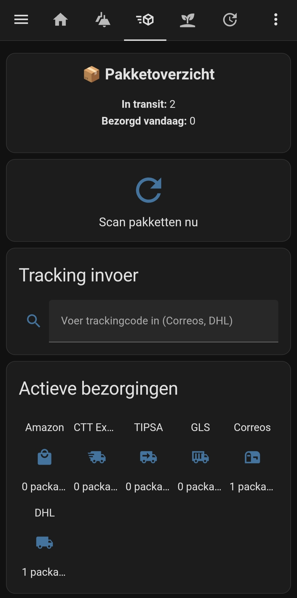
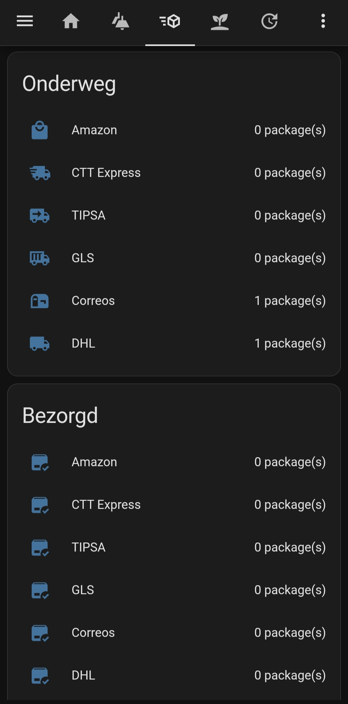

# Home Assistant Mail & Packages (EU Fork)


[](https://github.com/hacs/integration)

---

## What is this?

This is a **European-focused fork** of the original  
[Mail and Packages integration](https://github.com/moralmunky/Home-Assistant-Mail-And-Packages).

It improves package tracking for **EU carriers** and fixes limitations in the original integration.

---

## Key Features

### Multi-carrier tracking (EU focused)
- Correos (API-based tracking)
- DHL (email parsing support)
- GLS / CTT / others (via email parsing)

---

### Persistent manual tracking
- Add tracking codes manually
- Stored **persistently** in Home Assistant storage
- Packages remain visible even after:
  - rescans
  - clearing input fields
  - restarts

---

### Improved tracking behavior
- No more disappearing packages after rescans
- Works independently from email presence
- Better handling of multi-carrier environments

---

### Dashboard-friendly sensors
- Active packages
- In transit
- Delivered
- Per carrier + total overview

## Installation

### Requirements

Before installing this integration, make sure you have:

* Home Assistant running
* An email account accessible via IMAP
* Shipment notification emails being sent to that email account
* (For Gmail) an app password if 2FA is enabled

---

### Install via HACS (recommended)

1. Open **HACS** in Home Assistant
2. Go to **Integrations**
3. Click the **⋮ menu (top right)** → **Custom repositories**
4. Add this repository

   * Category: **Integration**
5. Search for **Mail and Packages (EU Fork)**
6. Click **Install**
7. Restart Home Assistant

---

### Manual installation

1. Download the latest release from this repository

2. Extract the contents

3. Copy the folder:

   ```
   custom_components/mail_and_packages
   ```

   into your Home Assistant configuration folder:

   ```
   /config/custom_components/mail_and_packages
   ```

4. Restart Home Assistant

---

### Add the integration

1. Go to **Settings → Devices & Services**
2. Click **Add Integration**
3. Search for **Mail and Packages**
4. Enter your IMAP email settings
5. Select the carriers/sensors you want to enable
6. Finish setup

---

### Optional: Manual tracking input

This fork supports manual tracking codes via a Home Assistant helper.

Create a helper:

* Type: **Text**
* Entity:

  ```
  input_text.correos_tracking
  ```

You can enter:

* Correos tracking codes
* DHL tracking codes

Then run the service:

```
mail_and_packages.force_scan
```

to refresh package data instantly.

---

### Notes

* Correos manual tracking uses the Correos API
* DHL is currently supported via email parsing
* Manual tracking codes are stored persistently
* Tracking remains active even after clearing the helper input


## Example Dashboard

### PC
<p align="center">
   
</p>
<p align="center">
   
</p>

### Mobile
<p align="center">
  
</p>
<p align="center">
  
</p>

---

## Important difference from original

Original integration:
- Focused mainly on **USPS / US carriers**
- Relies heavily on **email presence**
- No persistent manual tracking

This fork:
- Focused on **EU logistics**
- Adds **persistent tracking**
- Improves reliability for daily usage

---

## How it works

The integration connects to your email (IMAP) and:
- Parses shipment emails from supported carriers
- Extracts tracking info and status
- Combines with manually added tracking codes
- Updates Home Assistant sensors

All processing is **local** (no external services)

---

## Privacy & Security

- Runs fully local in Home Assistant
- No external APIs required (except optional carrier APIs like Correos)
- Files in `/www` may be publicly accessible (see HA docs)

---

## Configuration

See original documentation:
https://github.com/moralmunky/Home-Assistant-Mail-And-Packages/wiki

---

## Credits

- Original project:  
  https://github.com/moralmunky/Home-Assistant-Mail-And-Packages

- This fork builds upon that work and extends it for EU usage

---

## Feedback / Issues

If you encounter issues or have feature requests:
Open an issue on this repository

---

## Support

If this project helps you:
- Star the repo
- Report issues
- Suggest improvements
